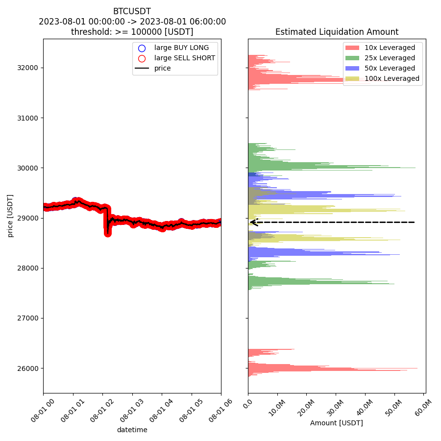

[](https://www.python.org/downloads/release/python-3110//)
[](https://github.com/aoki-h-jp/py-liquidation-map/actions/workflows/Formatter.yml)

# py-liquidation-map
Visualize Liquidation Map from actual execution data. Supports for all historical data from binance and bybit. Receiving orders in real-time via websocket and drawing liquidation maps is being implemented.

## Installation

```bash
pip install git+https://github.com/aoki-h-jp/py-liquidation-map
```

## Usage
### Visualize liquidation map from historical data
Download binance BTCUSDT data from start_datetime to end_datetime and draw a liquidation map calculated from orders above threshold=100000 [USDT].
```python
from liqmap.mapping import HistoricalMapping

mapping = HistoricalMapping(
    start_datetime='2023-08-01 00:00:00',
    end_datetime='2023-08-01 06:00:00',
    symbol='BTCUSDT',
    exchange='binance',
)

mapping.liquidation_map_from_historical(
    mode="gross_value",
    threshold_gross_value=100000
)
```
### Output

### Visualize liquidation map depth
```python
from liqmap.mapping import HistoricalMapping

mapping = HistoricalMapping(
    start_datetime='2023-08-01 00:00:00',
    end_datetime='2023-08-01 06:00:00',
    symbol='BTCUSDT',
    exchange='binance',
)

mapping.liquidation_map_depth_from_historical(
    mode="gross_value",
    threshold_gross_value=100000
)
```

### Output


## If you want to report a bug or request a feature
Please create an issue on this repository!

## Disclaimer
This project is for educational purposes only. You should not construe any such information or other material as legal, tax, investment, financial, or other advice. Nothing contained here constitutes a solicitation, recommendation, endorsement, or offer by me or any third party service provider to buy or sell any securities or other financial instruments in this or in any other jurisdiction in which such solicitation or offer would be unlawful under the securities laws of such jurisdiction.

Under no circumstances will I be held responsible or liable in any way for any claims, damages, losses, expenses, costs, or liabilities whatsoever, including, without limitation, any direct or indirect damages for loss of profits.
